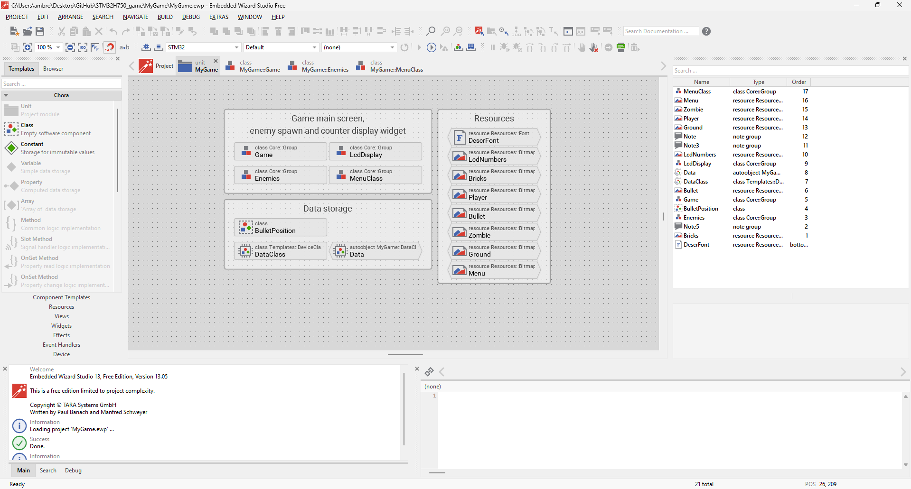
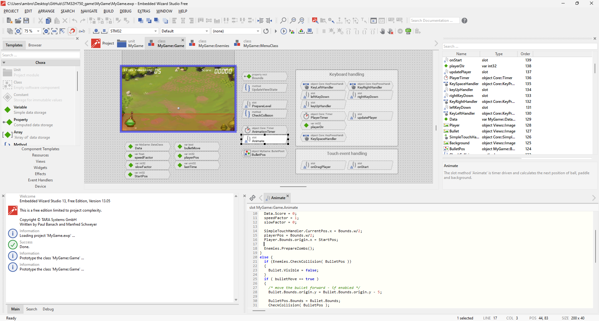
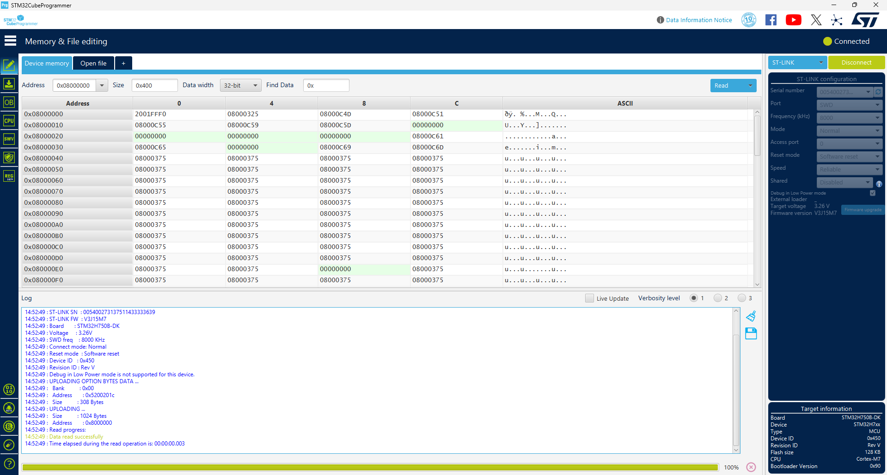
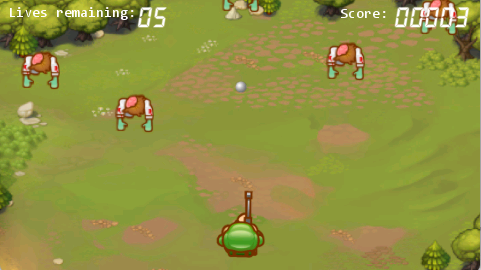
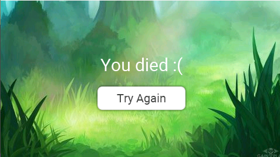

# STM32H750 Igra
Za moj projekt pri predmetu Vhodno Izhodne Naprave sem na STM32H750 plošči naredil igro na zaslonu na dotik na napravi. Igra je dvodimenzionalna z pogledom z vrha navzdol.

## Opis igre

Človek, katerga upravlja igralec se nahaja na spodni strani zaslona in strelja naravnost naprej. Z dotikom zaslona ga lahko premikamo levo in desno.
Igralca napadajo zombiji, ki prihajajo iz vrha zaslona in se pomikajo proti spodnjemu robu.
Cilj igre je zadeti čim več zombijev in jim preprečiti, da pridejo do spodnjega roba.

Igralec ima na voljo 5 življenj in enega zgubi vsakič, ko zombi uspešno pride do konca zaslona.
Ko mu zmaga življenj, igra konča in lahko začnemo od začetka.

Za vsakega uspešno eliminiranega zombija dobimo točko. Točke in prav tako življenja so prikazana na vrhu zaslona.

## Strojna in programska oprema

Igro sem naredil na plošči STM32H750XB. Za razvijanje igre sem uporabil program **Embedded Wizard** in Cube Programmer. Koda v projektu sem pisal v programskih jezikih chora in c.

### Embedded Wizard

Embedded Wizard je program, ki je namenjen ustvarjanju grafičnih vmesnikov na napravah z omejenimi viri. 

Gradnike projekta, kot naprimer razredi, funkcije, slike, objekti, gumbi, besedila, dodajamo grafično na delovno površino, nato pa jim lahko določamo in urejamo atribute. V funkcije, ki jih dodamo v projekt nato lahko pišemo kodo. Program uporablja predvsem programski jezik chora, ki deluje neodvisno od platforme in pa tudi jezik c, ki se specifično uporablja na plošči.

Ko naredimo naš željen grafični vmesnik v Embedded Wizardu, poženemu "build project", kar zgenerira datoteke za našo želeno platformo. Nato z priloženo .bat datoteko poženemo ukaz `make install`, ki na ploščo, s katero se povežemo s pomočjo programa Cube Programmer, flasha zgeneriran program.

### Cube Programmer

Cube Programmer je orodje za programiranje na STM32 napravah, ponuja pregled in upravljanje flash spomina na napravi, prav tako pa omogoča povezavo z napravo, kar sem potreboval za ta projekt.

## Opis programa

Igra vsebuje en glavni razred **Game** v katerem se igra izvaja. Znotraj razreda imamo igralca, ki se s pomočjo nekaj event handler funkcij premika glede na dotike na zaslonu.
Prav tako razred vsebuje funkcije PrepareLevel, CheckCollision, Animate, OnStart in OnDragPlayer.

#### OnStart()

Funkcija se izvede ob začetku programa in zabeleži začetno pozicijo igralca, da jo lahko ponastavimo kasneje, ko resetiramo igro.
Prav tako začne premikanje naboja.

#### OnDragPlayer()

Funkcija se izvede, ko se igralec dotakne zaslona in zabeleži pozicijo dotika.

#### PrepareLevel()

Funkcija se izvede ob začetku programa in nato vsakič, ko se igra resetira. Postavi vse spremenljivke, kot so življenja, točke, hitrost, na začetno vrednost, igralca nazaj na sredino in zombije na njihovo začetno pozicijo.

#### Animate()

Ta funkcija ze izvede vsak frame in premika naboj navzgor, zombije navzdol in igralca tja, kamor povlečemo po zaslonu. Vmes hkrati preverji kolizijo naboja z zgornjim robom zaslona z klicom funkcije **CheckCollision()**. Kolizije naboja z zombiji in zombija z spodnjim robom pa preveri z funkcijo CheckCollision, znotraj razreda, kjer se zombiji nahajajo.

Znotraj tega razreda imamo tudi razred **Enemies**, ki definira območje v katerem se lahko določajo začetne pozicije petih zombijev v igri. Vsebuje funkciji PrepareZombs in CheckCollision

#### PrepareZombs()

Funkcija se izvede ko začnemo ali resetiramo program in postavi zombije na naključno točko znotraj določenega območja.

#### CheckCollision()

Ta funkcija preverja ali je bil kateri od zombijev zadet in ga v tem primeru prestavi nazaj na novo naključno pozicijo v začetnem območju. Preveri tudi če je zombi prišel do konca in ga spet prestavi na novo začetno pozicijo. Temu primerno tudi prišteva točke oziroma odšteje življenja.

Ko igralcu zmanjka življenj se na zaslonu prikaže meni, ki se nahaja v razredu **MenuClass**.
Ta vsebuje funkcije **Show()** in **Hide()**, ki prikažeta in skrijeta meni ter **RestartGame()**, ki se izvede, ko pritisnemo na gumb in povzroči da se igra ponovno resetira in lahko začnemo z ponovnim igranjem.

Zadnji razred v programu pa je še **LcdDisplay**, ki se uporablja za prikaz točk in življenj na zaslonu.

## Video

Demo video delovanja igre.

https://github.com/user-attachments/assets/21fc073e-8288-4a9d-bb28-dde3f7b5c51c

